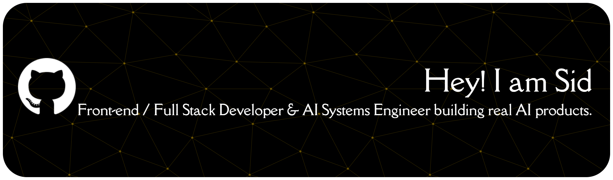

<!-- ======================= HEADER BANNER ======================= -->

<!-- Typing animation -->

<!-- ======================= ABOUT ME ======================= -->
## 👋 About Me

I'm a developer who loves shipping **AI-powered products** — from RAG chatbots and on-call incident agents to a full stock-market platform with a Python data worker running on cron. I move comfortably across the stack: **Next.js/React** on the front, **Python/FastAPI** on the back, and **LLMs** wired through the middle.

- 🔭 **Currently building:** [StockApp](https://github.com/Sidd1542004) — a beginner-to-pro stock platform (US/Indian stocks, ETFs, crypto, paper trading, AI insights) with a Supabase backend and an automated data worker.
- 🤖 **Focused on:** RAG systems, agentic AI, and production LLM integration (OpenAI · Gemini · Claude · Groq).
- 🌱 **Learning:** scaling AI apps, clean architecture, and evaluation-driven LLM development.
- 💬 **Ask me about:** Next.js, React, TypeScript, Python, FastAPI, and connecting LLMs to real products.
- ⚡ **Fun fact:** I've hand-coded everything from a 3D CSS-only image carousel to a chess engine with full checkmate detection.

<!-- EDIT: add your real name, city, or a personal line here -->

 

<!-- ======================= TECH STACK ======================= -->
## 🛠️ Tech Stack

**Languages**

**Frontend**

**Backend & AI/ML**

**Databases & DevOps**

 

<!-- ======================= FEATURED PROJECTS ======================= -->
## 🚀 Featured Projects

<table>
<tr>
<td width="50%" valign="top">

### 📈 StockApp
Full-stack stock platform for beginners → pros: US/Indian stocks, ETFs, crypto, paper trading, screeners, watchlists, alerts & AI insights. A **Python worker** runs every 30 min on **GitHub Actions** to fetch prices/fundamentals and pipe them into **Supabase**.

`Next.js` · `TypeScript` · `Python` · `Supabase`

[🌐 web](https://github.com/Sidd1542004/stockapp-web) · [⚙️ worker](https://github.com/Sidd1542004/stockapp-worker)

</td>
<td width="50%" valign="top">

### 🚨 Incident-Copilot
AI on-call assistant. When a monitoring alert fires, it gathers context (recent deploys, logs, past incidents), then asks an LLM to form an **evidence-cited hypothesis with calibrated confidence**.

`TypeScript` · `LLM Agents` · `Observability`

[🔗 View Repo](https://github.com/Sidd1542004/Incident-copilot)

</td>
</tr>
<tr>
<td width="50%" valign="top">

### 🧠 DocuMind AI (RAG Chatbot)
Upload PDFs and ask context-aware questions. A retrieval-augmented pipeline pulls the most relevant chunks before the model answers — grounded, source-backed responses.

`Python` · `RAG` · `Embeddings`

[🔗 View Repo](https://github.com/Sidd1542004/documind-ai-rag-chatbot)

</td>
<td width="50%" valign="top">

### 🧪 PromptLab
A developer tool for working with AI models across providers — experiment with prompts against **Gemini, OpenAI & Groq** in one place.

`React` · `TypeScript` · `Gemini` · `OpenAI` · `Groq`

[🔗 View Repo](https://github.com/Sidd1542004/PromptLab)

</td>
</tr>
<tr>
<td width="50%" valign="top">

### 🩺 MediGuide AI
Next.js blood-report analyzer powered by **Google Gemini**, with share to WhatsApp/email/clipboard and PDF export via jsPDF + html2canvas.

`Next.js` · `Gemini API` · `jsPDF`

</td>
<td width="50%" valign="top">

### 💬 ChatApp
Real-time desktop chat inspired by WhatsApp — built on **Java Swing**, multithreaded **TCP sockets**, and **MySQL** for auth & persistent messaging.

`Java` · `Sockets` · `MySQL`

[🔗 View Repo](https://github.com/Sidd1542004/ChatApp)

</td>
</tr>
</table>

**Also worth a look:** [AI Customer Support Agent](https://github.com/Sidd1542004) (RAG · ChromaDB · FastAPI · Claude) · [Chess Game](https://github.com/Sidd1542004/Chess_game) (React) · [AI Content Generator + NFT](https://github.com/Sidd1542004) (React · Solidity)

 

<!-- ======================= GITHUB STATS ======================= -->
## 📊 GitHub Stats

 

 

 

<!-- ======================= CONNECT ======================= -->
## 🤝 Connect With Me

<!-- EDIT: replace the # with your real profile links -->

 

<i>⭐ From <a href="https://github.com/Sidd1542004">Sidd1542004</a> — thanks for stopping by!</i>

